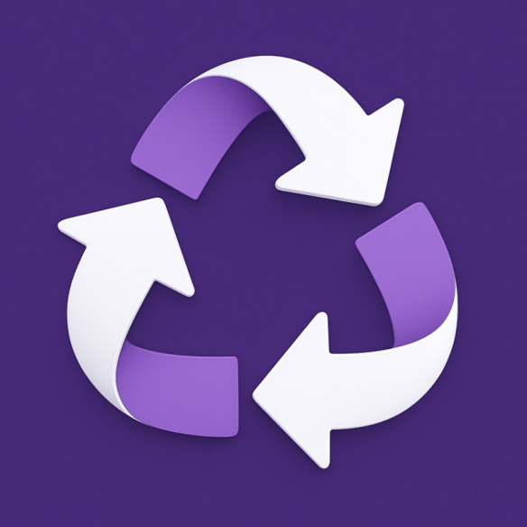

#  jwlFusion App

This is an **Android app**[^1] to merge backups created by *JW Library*[^2]. It works **off-line**: your data is not sent to anyone's website or a chatbot.

By using this software you agree to abide by the terms of its [License](https://github.com/erykjj/jwlFusion-app#License-1-ov-file).

**Latest release**: [jwlFusion_v0.20.0.apk](https://github.com/erykjj/jwlFusion-app/releases/download/v0.20.0/jwlFusion_v0.20.0.apk)

**Note**: Pick the two backup archives you wish to merge. The **Primary** one will take precedence in case of any conflicts; it will add to the **Secondary** one and over-write any duplicate records. The merge itself can take a few seconds, depending on the size of the archives. The merged backup will be "saved" (via *Share to…*) with a *jwlFusion_* prefix. You can send it to your cloud storage app (like *Google Drive*) to synchronize to your other device(s), where you can import it into *JW Library* ("Restore Backup").

____

Feel free to get in touch and post any [issues and/or suggestions](https://github.com/erykjj/jwlFusion-app/issues).

My other *JW Library* projects: [**JWLManager**](https://github.com/erykjj/jwlmanager) & [**jwlFusion** (desktop)](https://github.com/erykjj/jwlFusion)

____
#### Footnotes:
[^1]: Android 10+, arm64-v8a & x86_64; for armeabi-v7a devices, try [v0.11.0](https://github.com/erykjj/jwlFusion-app/releases/download/v0.11.0/jwlFusion_v0.11.0.apk) 

[^2]: [JW Library](https://www.jw.org/en/online-help/jw-library/) is a registered trademark of *Watch Tower Bible and Tract Society of Pennsylvania*
